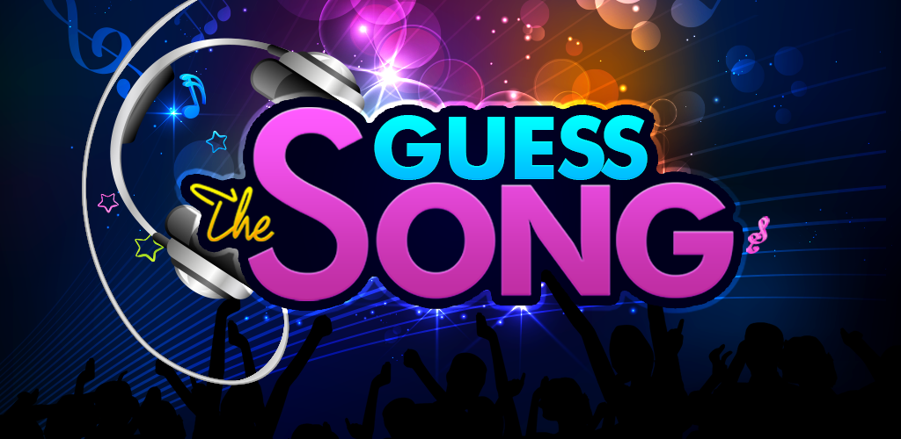

<!-- Improved compatibility of back to top link: See: https://github.com/othneildrew/Best-README-Template/pull/73 -->

<a id="readme-top"></a>

<!--
*** Thanks for checking out the Best-README-Template. If you have a suggestion
*** that would make this better, please fork the repo and create a pull request
*** or simply open an issue with the tag "enhancement".
*** Don't forget to give the project a star!
*** Thanks again! Now go create something AMAZING! :D
-->

<!-- PROJECT SHIELDS -->
<!--
*** I'm using markdown "reference style" links for readability.
*** Reference links are enclosed in brackets [ ] instead of parentheses ( ).
*** See the bottom of this document for the declaration of the reference variables
*** for contributors-url, forks-url, etc. This is an optional, concise syntax you may use.
*** https://www.markdownguide.org/basic-syntax/#reference-style-links
-->

<!-- PROJECT LOGO -->
<br />
<div align="center">
  <a href="https://m.media-amazon.com/images/I/81NF853al9L.png">
    
  </a>

  <h3 align="center">Guess the song!</h3>

  <p align="center">
    A fun way to test your music knowledge! Are you ready?
    <br />
    <br />
  </p>
</div>

<!-- TABLE OF CONTENTS -->
<details>
  <summary>Table of Contents</summary>
  <ol>
    <li>
      <a href="#about-the-project">About The Project</a>
    </li>
    <li>
      <a href="#getting-started">Getting Started</a>
      <ul>
        <li><a href="#prerequisites">Prerequisites</a></li>
        <li><a href="#installation">Installation</a></li>
      </ul>
    </li>
    <li><a href="#usage">Usage</a></li>
</details>

<!-- ABOUT THE PROJECT -->

## About The Project

This program does not use any premium services like Spotify or Soundcloud, so it's completely free to use.

Due to that, to be able to have music data, it extracts .mp3 files from YouTube videos, so once the user selects their game parameters, the songs will be download for the first time.

That adds a little bit of wait time to the user, but it guarantees a completely free experience, only a Spotify API key is necessary, but it's free as well.

There are 3 possible difficulties, 72 music genres and 5 decades to choose from.

The difficulties work as follows:

- Easy -> The user can select the genre and the year and they are hinted the 4 first letters of each guess.
- Normal -> The user can select the genre and the year, but they get no hints.
- Hard -> The user can select only the genre, the year will be randomly chosen from the 90s to 2020.

<p align="right">(<a href="#readme-top">back to top</a>)</p>

## Getting Started

### Prerequisites

External libraries needed:

- pandas
- tkinter
- yt_dlp
- spotipy
- pillow

### Installation

1. Make your own clone of the repo.

2. From the terminal window, install the needed libraries:
   ```sh
   pip install pandas tk yt_dlp spotipy pillow
   ```

<p align="right">(<a href="#readme-top">back to top</a>)</p>

<!-- USAGE EXAMPLES -->

## Usage

Once the game parameters are chosen in the starting window, the 30 most popular songs with those parameters will be retrieved from Spotify and downloaded from YouTube.

If those parameters have already been used by the user, then the songs won't be download again and the game will skip to the guessing window.

Each correct guess is worth 1 point, so the user can score up to 3 points with each song (song name, artist and album).

The order of the songs is randomly determined.

<p align="right">(<a href="#readme-top">back to top</a>)</p>
